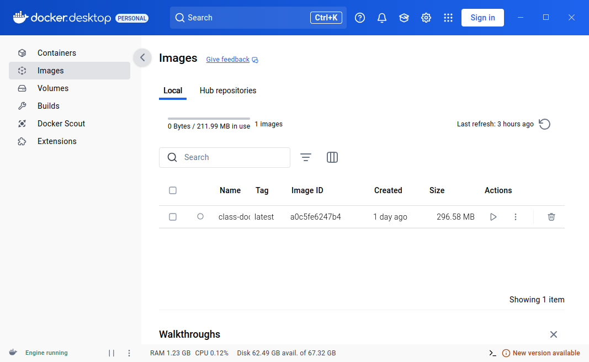
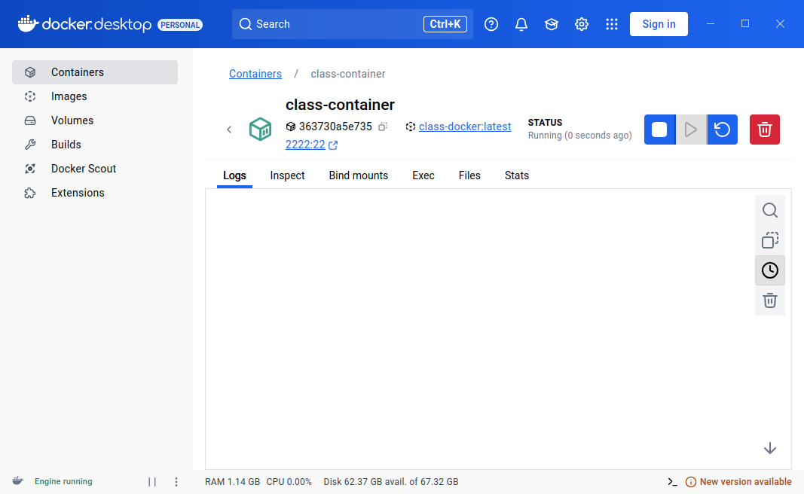
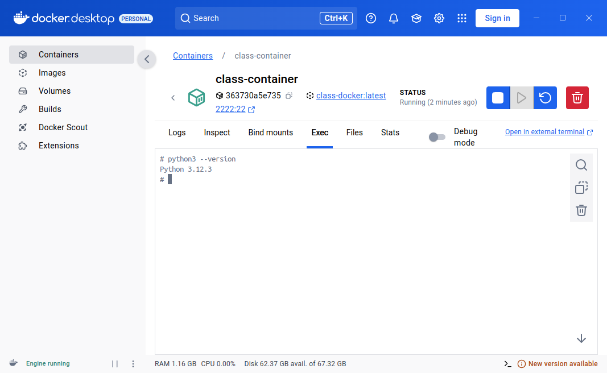

# Start the class Docker container

This guide will help you build, run, and test the class Docker container using Docker Desktop. The container is designed to provide a consistent Python environment for our classwork.

---

## Prerequisites

Before you begin, make sure you have:

1. **Docker Desktop** installed on your computer.
   - Download it from [Docker Desktop](https://www.docker.com/products/docker-desktop).
   - Follow the installation instructions for your operating system.
   - Open Docker Desktop and navigate to the "Images" tab, which should be empty:


2. **The Dockerfile** provided for the class.
   - Save the following content into a file named `Dockerfile` in a new directory on your computer:

   ```dockerfile
   FROM ubuntu:24.04
   ENV DEBIAN_FRONTEND=noninteractive
   RUN apt-get update && apt-get install -y --no-install-recommends \
       python3 \
       python3-pip \
       bash \
       openssh-server
   RUN mkdir /var/run/sshd && echo 'root:rootpassword' | chpasswd
   EXPOSE 22
   CMD ["/usr/sbin/sshd", "-D"]
   ```

---

## Step 1: Build the Docker image

1. **Open a terminal**:
   - Navigate to the directory where your `Dockerfile` is saved.

2. **Run the build command**:
   - Use the terminal to build the image:

     ```bash
     docker build -t class-docker .
     ```

3. **Verify the image**:
   - Open Docker Desktop and select the "Images" tab.
   - Check that your new image (`class-docker`) is listed.



---

## Step 2: Run the Docker Container

1. **Launch the container** from Docker Desktop:
   - Go to the "Images" tab.
   - Click the play icon next to the `class-docker` image.
   - Set the following options:
     - **Name**: `class-container`
     - **Ports**: Map "Container port" `22` to "Host port" `2222`.
     - **Volumes**: In "Host path," enter the directory that you want to share with the container.  In "Container path," enter `/workspace`


> [!IMPORTANT]  
> Setting a Volume is important because only files stored in that directory will survive if the container is destroyed!

2. Alternatively, you can **use the terminal** to run the container:

   ```bash
   docker run -dit --name class-container -p 2222:22 class-docker
   ```

3. **Verify the container is running**:
   - In Docker Desktop, check that the `class-container` status shows as "Running."



   - Or, use the terminal:

     ```bash
     docker ps
     ```

---

## Step 3: Test the container

### Access the container

1. Use Docker Desktop’s integrated shell, and test the Python installation:

   ```bash
   python3 --version
   ```



The integrated shell is running on the Ubuntu/Linux operating system inside the container.  You can learn the basic commands of the command line interface from this [cheat sheet](p/ubuntu-cli-cheat-sheet.pdf).

2. Alternatively, open your system's terminal to connect to the container:
 
  ```bash
   docker exec -it class-container bash
   ```


---

## When you're done: Stop (and later restart) the container

In Docker Desktop, click the stop or play button in the Containers tab.

Or, in the terminal:

- To stop the container:

  ```bash
  docker stop class-container
  ```

- To restart the container:
 
  ```bash
  docker start class-container
  ```

---

## Troubleshooting

1. **Docker Desktop not running**:
   - Ensure Docker Desktop is open and the engine is running.
2. **Port conflicts**:
   - If port `2222` is already in use, choose a different port (e.g., `2233`) when running the container.
3. **SSH connection fails**:
   - Check that the container is running.
   - Verify the port mapping in Docker Desktop.

---

## Summary

You’ve now set up the class Docker container, confirmed it works, and learned how to manage it using Docker Desktop. This container will be your consistent Python environment for all class activities.

In the future, you could make new containers for new projects and manage them in Docker Desktop or submit them to Docker Hub.

---

Previous: [Introduction to containerization](001-introduction-to-containerization.md)

Next: [Connecting VSCode to your Docker container](003-connect-with-vscode.md)
